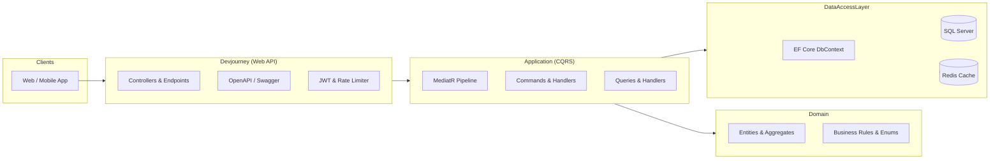

<div align="center">

# 🚀 DevJourney API

**High-Performance Backend Platform for Hackathons, Competitions & Developer Ecosystems**

[](https://dotnet.microsoft.com/)
[](https://learn.microsoft.com/en-us/dotnet/csharp/)
[](https://learn.microsoft.com/en-us/ef/core/)
[](https://redis.io/)
[](https://www.docker.com/)
[](https://opentelemetry.io/)

</div>

---

## 📖 Overview

**DevJourney** is an enterprise-grade competition and hackathon lifecycle management platform built with **.NET 10** using **Clean Architecture** and **CQRS (Command Query Responsibility Segregation)**.

It powers end-to-end hackathon operations—from student team registrations and project submissions to partner judging rubrics, jury evaluations, public leaderboards, and cryptographically verifiable digital certificates.

---

## ✨ Key Features

### 🎓 Students & Teams
- **Participant Profiles & Portfolios:** Academic, contact, developer links, and verified participation history.
- **Team Formation:** Competition-scoped teams with join codes, invite handling, and captain/member roles.
- **Project Submissions:** Pitch deck asset uploads, GitHub repo verification, and status tracking.
- **Digital Certificates:** Publicly verifiable placement and participation certificates (`/verify/{id}`).

### 🏢 Partners & Organizations (Universities & Companies)
- **Competition Management:** Full lifecycle management (draft, registration, active, judging, completed).
- **Rubric & Scoring Matrix:** Configurable criteria weights and maximum score definitions.
- **Pipeline & Attendance:** Supporter check-in workspaces with strict privacy boundaries (e.g. finalist protection).
- **Broadcasts & Support:** Targeted announcements (all, finalists, specific teams) and threaded support tickets.

### ⚖️ Jury Evaluation System
- **Scored Evaluations:** Weighted multi-criterion scoring workflow clamped to rubric boundaries.
- **Real-Time Scoreboards:** Server-calculated rankings and leaderboard publication workflows.

### 🛡️ Enterprise Core & Security
- **Identity & RBAC:** ASP.NET Core Identity with role-based policies (Admin, Partner, Company, Jury, Student, Supporter).
- **Security Protections:** Rate limiting, JWT Bearer tokens (headers & cookies), and strict CORS control.
- **Observability & Diagnostics:** OpenTelemetry distributed tracing and metrics (HTTP, SQL, Runtime).
- **Dual-Tier Caching:** .NET 10 `HybridCache` with in-memory L1 and Redis L2 distributed cache.

---

## 🏛️ Architecture

DevJourney follows **Clean Architecture** and **CQRS**, strictly decoupling business rules from infrastructure and presentation concerns:

```
├── 📁 Devjourney          # Web API layer (Endpoints, Swagger Docs, Middlewares, Filters)
├── 📁 Application         # Application core (CQRS Commands, Queries, Handlers, Validations, Mappings)
├── 📁 Domain              # Enterprise entities, Value Objects, Enums, and Core Interfaces
├── 📁 DataAccessLayer     # Infrastructure & persistence (EF Core, SQL Server, Seeders, Repositories)
└── 📁 DevJourney.Tests    # Automated unit and integration test suite
```



---

## 🛠️ Tech Stack

| Component | Technology | Description |
| :--- | :--- | :--- |
| **Framework** | .NET 10 (C# 13) | Tiered PGO, Server GC, Kestrel HTTP/1+2+3 |
| **Patterns** | Clean Architecture, CQRS | MediatR, Repository Pattern, Dependency Injection |
| **Database** | SQL Server + EF Core 10 | `DbContextPool`, automated migrations & data seeding |
| **Caching** | HybridCache + Redis 7 | In-memory L1 + Redis distributed L2 caching |
| **Authentication** | ASP.NET Core Identity + JWT | Bearer tokens, password policies, account lockout |
| **Telemetry** | OpenTelemetry | AspNetCore, HttpClient, SqlClient, Runtime metrics/traces |
| **Documentation** | Swagger / OpenAPI | Segmented docs: Core/Student, Partner, Company, Admin |
| **Testing & QA** | xUnit, Moq, Schemathesis, ZAP, k6 | Unit tests, API fuzzing, OWASP security, load testing |

---

## 🚦 Getting Started

### Prerequisites
- [.NET 10 SDK](https://dotnet.microsoft.com/download/dotnet/10.0)
- [Docker & Docker Compose](https://www.docker.com/) *(optional, for containerized run)*
- [SQL Server](https://www.microsoft.com/en-us/sql-server) *(local or Docker instance)*

---

### ⚙️ Configuration

Set your connection string and JWT secret via `Devjourney/appsettings.json` or environment variables:

```json
{
  "ConnectionStrings": {
    "DefaultConnection": "Server=localhost,1433;Database=DevJourney;User Id=sa;Password=YourSecurePassword123!;TrustServerCertificate=True;",
    "Redis": "localhost:6379"
  },
  "Jwt": {
    "SecretKey": "YOUR_STRONG_SECRET_KEY_MINIMUM_32_CHARACTERS_LONG",
    "Issuer": "DevJourneyAPI",
    "Audience": "DevJourneyClient"
  }
}
```

> [!IMPORTANT]
> The application enforces secure, non-default configuration at startup. Placeholder credentials will cause startup validation to fail by design.

---

### 💻 Running Locally

1. **Clone the repository:**
   ```bash
   git clone https://github.com/Jafarli-Mahammad/DevJourney.git
   cd DevJourney
   ```

2. **Restore dependencies:**
   ```bash
   dotnet restore
   ```

3. **Run database migrations & start the API:**
   ```bash
   dotnet run --project Devjourney
   ```

4. **Access the API:**
   - Base URL: `http://localhost:5074`
   - Interactive Swagger Docs: `http://localhost:5074/swagger`

---

### 🐳 Running with Docker Compose

To quickly spin up the API along with Redis:

```bash
docker compose up -d --build
```

- API endpoint: `http://localhost:8080`
- Redis server: `127.0.0.1:6379`

---

## 📚 API Documentation

Interactive Swagger specifications are segmented into distinct audience documentation:

| Document | Path | Scope |
| :--- | :--- | :--- |
| **Core & Student API** | `/swagger/v1/swagger.json` | Student Profiles, Competitions, Scoreboards, Platform Services |
| **Partner Portal API** | `/swagger/partner/swagger.json` | Partner Workspace, Hackathon Management, Staff & Jury Coordination |
| **Company API** | `/swagger/company/swagger.json` | Corporate Registration, Auth, Company Profiles & Challenges |
| **Admin API** | `/swagger/admin/swagger.json` | Administrative Operations, RBAC & Global Configuration |

---

## 🧪 Testing & Quality Assurance

```bash
# Run unit & integration test suites
dotnet test

# Run Schemathesis API fuzzing (requires active local API)
./scripts/run-schemathesis.sh

# Run OWASP ZAP baseline security scan
./scripts/run-zap-scan.sh

# Run k6 load performance tests
k6 run loadtests/performance.js
```

---

## 🤝 Contributing

Contributions are welcome! Please feel free to open an issue or submit a pull request.

1. Fork the Project
2. Create your Feature Branch (`git checkout -b feature/AmazingFeature`)
3. Commit your Changes (`git commit -m 'feat: Add AmazingFeature'`)
4. Push to the Branch (`git push origin feature/AmazingFeature`)
5. Open a Pull Request

---

<div align="center">
  <sub>Built with ❤️ by Mahammad Jafarli and contributors.</sub>
</div>
