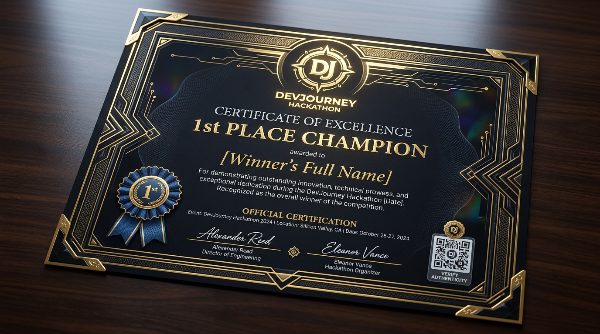
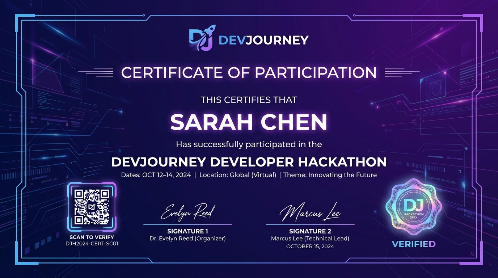
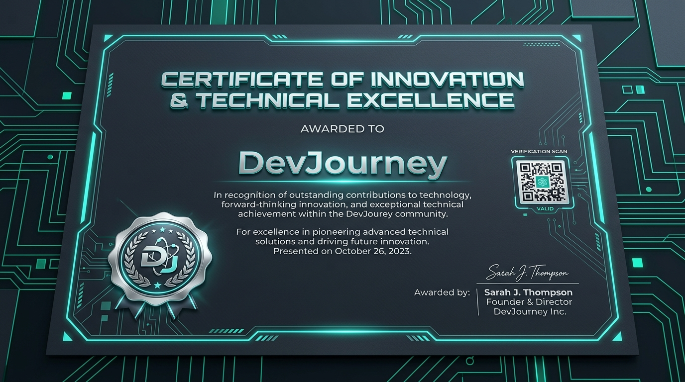

# 🏆 Custom Designed DevJourney Certificates

Here are the 3 custom high-resolution certificate artworks designed for the DevJourney platform:

---

## 1. 🥇 1st Place Champion / Winner Certificate
> **Style:** Obsidian Black & Luxury Gold Foil, intricate geometric guilloche borders, official DevJourney champion emblem, digital signature block, and QR verification badge.

* **Asset Location:** `Certificates/winner_certificate.jpg`
* **Assigned To:** Competition Winners & Hackathon Champions

---

## 2. 🎖️ Certificate of Participation
> **Style:** Deep Indigo & Royal Purple Cyber Gradient, holographic DevJourney security seal, modern sleek borders, and cryptographic verification badge.

* **Asset Location:** `Certificates/participant_certificate.jpg`
* **Assigned To:** All Hackathon & Competition Participants

---

## 3. 💎 Certificate of Innovation & Technical Excellence
> **Style:** Dark Slate & Cyan Neon Microchip Grid, platinum silver medal emblem, futuristic typography, and digital QR validator.

* **Asset Location:** `Certificates/innovation_certificate.jpg`
* **Assigned To:** Special Category, Best MVP & Most Innovative Projects

---

### File Locations in Codebase
* **Root Certificate Folder:** [`Certificates/`](file:///home/mahammadjafarli/source/repos/DevJourney/Certificates/)
* **Backend Web Root:** [`Devjourney/wwwroot/certificates/`](file:///home/mahammadjafarli/source/repos/DevJourney/Devjourney/wwwroot/certificates/)
* **Frontend Public Assets:** [`public/certificates/`](file:///home/mahammadjafarli/source/repos/DevJourneyFront/devjourney/public/certificates/) & [`public/assets/certificates/`](file:///home/mahammadjafarli/source/repos/DevJourneyFront/devjourney/public/assets/certificates/)
